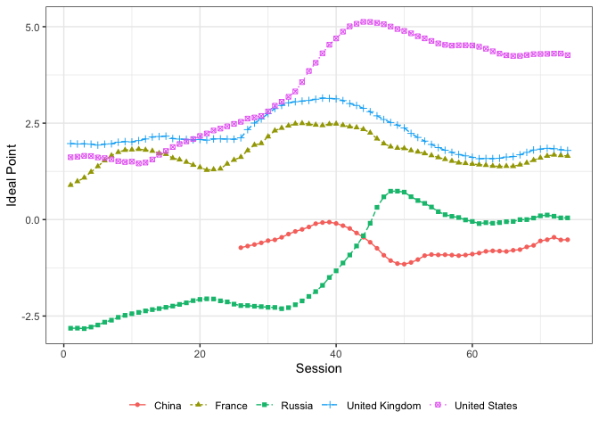

<!-- README.md is generated from README.Rmd. Please edit that file -->

# poEMirt

<!-- badges: start -->

[](https://github.com/vkyo23/poEMirt/actions/workflows/R-CMD-check.yaml)
<!-- badges: end -->

`poEMirt` is an `R` package that implements fast EM item response theory
for cross-national public opinion data to estimate dynamic latent public
opinion. The model utilizes the Polya-Gamma data augmentation scheme
(Polson, Scott & Windle 2013) and exact EM algorithm (Goplerud 2019) for
fast computation. This package directly incorporates C++ programming and
does not depend on ready-made other statistical modeling languages, thus
the computation is much efficient. It can be applied to not only
binomial and multinomial outcomes but also bernoulli and categorial
ones. Users can estimate statistical uncertainty by parametric bootstrap
and Gibbs Sampling.

## Installation

You can install the development version of `poEMirt` from
[GitHub](https://github.com) with:

``` r
remotes::install_github("vkyo23/poEMirt")
```

## Usage

### Multinomial outcome

``` r
library(poEMirt)
library(tidyr)
library(dplyr)
library(stringr)
data("sim_data_dynamic")

head(sim_data_dynamic)
#> # A tibble: 6 × 8
#>       i     j     t    y1    y2    y3    y4    y5
#>   <int> <int> <dbl> <int> <int> <int> <int> <int>
#> 1     1     4     1   558   346    NA    NA    NA
#> 2     1     5     1   212   102   424    NA    NA
#> 3     1     6     1   452   355    NA    NA    NA
#> 4     1     7     1    NA   157    49   480    NA
#> 5     1     8     1    NA    77    48   322    NA
#> 6     1     9     1   245   127   390    NA    NA
tail(sim_data_dynamic)
#> # A tibble: 6 × 8
#>       i     j     t    y1    y2    y3    y4    y5
#>   <int> <int> <dbl> <int> <int> <int> <int> <int>
#> 1   200   393    40    NA    77   109    46   328
#> 2   200   395    40   154   469    NA    NA    NA
#> 3   200   396    40    NA   126   140   415    NA
#> 4   200   398    40   257   683    NA    NA    NA
#> 5   200   399    40   502   300    NA    NA    NA
#> 6   200   400    40    NA   202   598    NA    NA

# Convert into poEMirt-readable data
data <- read_poEMirt(
  data = sim_data_dynamic,
  responses = paste0("y", 1:5),
  i = "i",
  j = "j",
  t = "t"
)
summary(data)
#> ----- poEMirtData summary -----
#> * Data size:
#>   - I =  200 
#>   - J =  400
#>   - T =  40 
#>   - min(Kj) =  2 
#>   - max(Kj) =  5 
#>   - mean(Kj) = 3.44 
#> * NA rate: 84.3%

# Fit the model
fit <- poEMirt(
  data = data,
  model = "dynamic",
  theta_std = TRUE, # Standardizing theta
  control = list(
    verbose = 10
  )
)
#> === poEMirt starts! ===
#> * Setting priors.....DONE!
#> * Finding best initial values.....DONE!
#> * Expectation-Maximization
#>   - Iteration 10: eval = 1.78972e-06
#> * Model converged at iteration 12 : 0.1 sec.

# Summarize the result
summary(fit, parameter = "theta")
#> * Summarizing following parameters: theta
#> # A tibble: 7,581 × 4
#>    parameter index  reference estimate
#>    <chr>     <chr>  <chr>        <dbl>
#>  1 theta     [1,1]  [i,t]       -0.673
#>  2 theta     [1,2]  [i,t]       -0.769
#>  3 theta     [1,3]  [i,t]       -0.675
#>  4 theta     [1,4]  [i,t]       -0.670
#>  5 theta     [1,5]  [i,t]       -0.701
#>  6 theta     [1,6]  [i,t]       -0.756
#>  7 theta     [1,7]  [i,t]       -0.871
#>  8 theta     [1,8]  [i,t]       -0.978
#>  9 theta     [1,9]  [i,t]       -1.07 
#> 10 theta     [1,10] [i,t]       -1.04 
#> # ℹ 7,571 more rows
```

#### Repeated items and bridging estimation

Public opinion data typically contains repeated items over time. To
strictly estimate the change in latent traits, one should do bridging
estimation by pinning down the location of cutpoints (alpha) of repeated
items (Baiely 2007). In the previous example, we saw that `j` is unique
in terms of `t`, but in this example, simulated data below has repeated
`j`. `read_poEMirt()` automatically detects such repeated items and
creates a poEMirt-readable object. Users can do bridging estimation by
setting `alpha_fix = TRUE` in `poEMirt()`.

``` r
# Repeated item data
data("sim_data_dynamic_repeated")
head(sim_data_dynamic_repeated)
#> # A tibble: 6 × 8
#>       i     j     t    y1    y2    y3    y4    y5
#>   <int> <int> <int> <int> <int> <int> <int> <int>
#> 1     1     1     1   317   280    NA    NA    NA
#> 2     1     5     1   171   145   465    NA    NA
#> 3     1     8     1    NA    37    22   335    NA
#> 4     1     9     1   283    85   487    NA    NA
#> 5     1     1     2   458   419    NA    NA    NA
#> 6     1     4     2   304   410    NA    NA    NA

data2 <- read_poEMirt(
  data = sim_data_dynamic_repeated,
  responses = paste0('y', 1:5),
  i = "i",
  j = "j",
  t = "t"
)
#> * Detecting repeated j [10 / 10] :
#>   - Set `alpha_fix = TRUE` in `poEMirt()` to fix alpha of same repeated items.

# Fit the model
fit2 <- poEMirt(
  data = data2,
  model = "dynamic",
  theta_std = TRUE,
  alpha_fix = TRUE, # Fix alpha or not
  control = list(
    verbose = 10
  )
)
#> === poEMirt starts! ===
#> * Setting priors.....DONE!
#> * Finding best initial values.....DONE!
#> * Expectation-Maximization
#> * Model converged at iteration 10 : 0.1 sec.

# Same cutpoint estimates!
summary(fit2, parameter = "alpha") |> 
  filter(str_detect(index, "\\[\\d+,1,.+"))
#> * Summarizing following parameters: alpha
#> # A tibble: 40 × 4
#>    parameter index     reference estimate
#>    <chr>     <chr>     <chr>        <dbl>
#>  1 alpha     [1,1,y1]  [t,j,k]      0.183
#>  2 alpha     [2,1,y1]  [t,j,k]      0.183
#>  3 alpha     [3,1,y1]  [t,j,k]      0.183
#>  4 alpha     [4,1,y1]  [t,j,k]      0.183
#>  5 alpha     [5,1,y1]  [t,j,k]      0.183
#>  6 alpha     [6,1,y1]  [t,j,k]      0.183
#>  7 alpha     [7,1,y1]  [t,j,k]      0.183
#>  8 alpha     [8,1,y1]  [t,j,k]      0.183
#>  9 alpha     [9,1,y1]  [t,j,k]      0.183
#> 10 alpha     [10,1,y1] [t,j,k]      0.183
#> # ℹ 30 more rows
```

### Estimation of statistical uncertainty

To estimate statistical uncertainty (e.g., standard deviation), you can
use `poEMirt_uncertainty()`. In this function, you can choose
*parametric bootstrap* (`"bootstrap"`) or *Gibbs sampling* (`"gibbs"`).

#### Bootstrap

``` r
fit_boot <- poEMirt_uncertainty(
  fit = fit,
  method = "bootstrap",
  seed = 1,
  iter = 100,
  control = list(
    verbose = 10,
    thread = 8 # parallel
  )
)
#> === Parametric bootstrap to estimate statistical uncertainty for poEMirt ===
#> * Computing 100 bootstraps with 8 threads.....
#> * DONE! Total time: 18.6 sec.

summary(fit_boot, parameter = "theta", ci = 0.95)
#> * Summarizing following parameters:  theta
#> # A tibble: 7,581 × 7
#>    parameter index  reference estimate     sd ci_lwr95 ci_upr95
#>    <chr>     <chr>  <chr>        <dbl>  <dbl>    <dbl>    <dbl>
#>  1 theta     [1,1]  [i,t]       -0.673 0.0436   -0.758   -0.587
#>  2 theta     [1,2]  [i,t]       -0.769 0.0408   -0.849   -0.689
#>  3 theta     [1,3]  [i,t]       -0.675 0.0380   -0.749   -0.600
#>  4 theta     [1,4]  [i,t]       -0.670 0.0453   -0.759   -0.581
#>  5 theta     [1,5]  [i,t]       -0.701 0.0461   -0.792   -0.611
#>  6 theta     [1,6]  [i,t]       -0.756 0.0500   -0.854   -0.658
#>  7 theta     [1,7]  [i,t]       -0.871 0.0517   -0.972   -0.770
#>  8 theta     [1,8]  [i,t]       -0.978 0.0500   -1.08    -0.880
#>  9 theta     [1,9]  [i,t]       -1.07  0.0391   -1.14    -0.991
#> 10 theta     [1,10] [i,t]       -1.04  0.0484   -1.13    -0.945
#> # ℹ 7,571 more rows
```

#### Gibbs sampling

Using EM estimates as starting values of Gibbs sampler.

``` r
fit_gibbs <- poEMirt_uncertainty(
  fit = fit,
  method = "gibbs",
  seed = 1,
  iter = 500,
  control = list(
    verbose = 100,
    warmup = 100,
    thin = 5
  )
)
#> === Gibbs Sampling to estimate statistical uncertainty for poEMirt ===
#> * Warmup 1 / 600
#> * Warmup 100 / 600
#> * Sampling 200 / 600
#> * Sampling 300 / 600
#> * Sampling 400 / 600
#> * Sampling 500 / 600
#> * Sampling 600 / 600
#> * DONE! Total time: 11.5 sec.

summary(fit_gibbs, parameter = "theta", ci = 0.95)
#> * Summarizing following parameters: theta
#> # A tibble: 7,581 × 9
#>    parameter index  reference   mean median     sd ci_lwr95 ci_upr95  rhat
#>    <chr>     <chr>  <chr>      <dbl>  <dbl>  <dbl>    <dbl>    <dbl> <dbl>
#>  1 theta     [1,1]  [i,t]     -0.608 -0.604 0.0635   -0.739   -0.492 0.994
#>  2 theta     [1,2]  [i,t]     -0.662 -0.671 0.0709   -0.775   -0.522 1.09 
#>  3 theta     [1,3]  [i,t]     -0.572 -0.577 0.0579   -0.673   -0.441 1.01 
#>  4 theta     [1,4]  [i,t]     -0.620 -0.623 0.0904   -0.813   -0.449 1.00 
#>  5 theta     [1,5]  [i,t]     -0.658 -0.659 0.0908   -0.815   -0.476 0.996
#>  6 theta     [1,6]  [i,t]     -0.683 -0.687 0.0498   -0.775   -0.592 0.996
#>  7 theta     [1,7]  [i,t]     -0.739 -0.738 0.0818   -0.866   -0.554 0.997
#>  8 theta     [1,8]  [i,t]     -0.799 -0.806 0.0872   -0.970   -0.612 1.01 
#>  9 theta     [1,9]  [i,t]     -0.854 -0.854 0.0986   -1.06    -0.679 0.993
#> 10 theta     [1,10] [i,t]     -0.908 -0.906 0.0978   -1.08    -0.731 1.03 
#> # ℹ 7,571 more rows
```

### Binary, categorical outcome

Notably, `poEMirt` can also be applied to roll-call vote,
individual-level survey, and exam data analysis where outcomes are
binary or categorical since these are the special case of `poEMirt`
where n = 1 for each observation.

#### Binary

Using the roll-call vote data of U.S. Supreme Court `Rehnquist` from
[`{MCMCpack}`](https://github.com/cran/MCMCpack) by Martin, Quinn & Park
(2011). The outcome of interest is 1 if a judge votes yea and 0 if nay.

``` r
data(Rehnquist, package = "MCMCpack")

df <- Rehnquist |> 
  mutate(rcid = row_number()) |> 
  select(-term) |> 
  mutate(
    time = factor(time) |> 
      as.integer()
  ) |> 
  pivot_longer(
    cols = -c(time, rcid),
    names_to = "judge",
    values_to = "vote"
  ) 
head(df)
#> # A tibble: 6 × 4
#>    time  rcid judge      vote
#>   <int> <int> <chr>     <dbl>
#> 1     1     1 Rehnquist     0
#> 2     1     1 Stevens       1
#> 3     1     1 O.Connor      0
#> 4     1     1 Scalia        0
#> 5     1     1 Kennedy       1
#> 6     1     1 Souter        1

#For binary data, users must create the columns of `outcome = 1` and `outcome = 0` data respectively. 
df <- df |> 
  mutate(
    y1 = 1L * (vote == 1),
    y0 = 1L * (vote == 0)
  )
head(df)
#> # A tibble: 6 × 6
#>    time  rcid judge      vote    y1    y0
#>   <int> <int> <chr>     <dbl> <int> <int>
#> 1     1     1 Rehnquist     0     0     1
#> 2     1     1 Stevens       1     1     0
#> 3     1     1 O.Connor      0     0     1
#> 4     1     1 Scalia        0     0     1
#> 5     1     1 Kennedy       1     1     0
#> 6     1     1 Souter        1     1     0

# Read data
data <- read_poEMirt(
  data = df,
  responses = c("y1", "y0"),
  i = "judge",
  j = "rcid",
  t = "time"
)
summary(data)
#> ----- poEMirtData summary -----
#> * Data size:
#>   - I =  9 
#>   - J =  485
#>   - T =  11 
#>   - min(Kj) =  2 
#>   - max(Kj) =  2 
#>   - mean(Kj) = 2 
#> * NA rate: 0.5%

# Constraint
con <- which(rownames(data$data$response) == "Thomas")
con <- rep(con, max(df$time))

# Fit
fit <- poEMirt(
  data = data,
  model = "dynamic",
  constraint = con,
  theta_std = TRUE,
  control = list(
    verbose = 10
  )
)
#> === poEMirt starts! ===
#> * Setting priors.....DONE!
#> * Finding best initial values.....DONE!
#> * Expectation-Maximization
#> * Model converged at iteration 3 : 0 sec.

summary(fit, parameter = "theta")
#> * Summarizing following parameters: theta
#> # A tibble: 99 × 4
#>    parameter index       reference estimate
#>    <chr>     <chr>       <chr>        <dbl>
#>  1 theta     [Breyer,1]  [i,t]       -0.841
#>  2 theta     [Breyer,2]  [i,t]       -0.856
#>  3 theta     [Breyer,3]  [i,t]       -0.872
#>  4 theta     [Breyer,4]  [i,t]       -0.875
#>  5 theta     [Breyer,5]  [i,t]       -0.870
#>  6 theta     [Breyer,6]  [i,t]       -0.868
#>  7 theta     [Breyer,7]  [i,t]       -0.893
#>  8 theta     [Breyer,8]  [i,t]       -0.891
#>  9 theta     [Breyer,9]  [i,t]       -0.880
#> 10 theta     [Breyer,10] [i,t]       -0.863
#> # ℹ 89 more rows
```

#### Categorical

Using the roll-call vote data of United Nations General Assembly
(session 1 to 74) from [`{unvotes}`](https://github.com/dgrtwo/unvotes)
by Robinson & Goguen-Compagnoni (2021). Note that the original data is
from Voeten (2013). The outcome of interest consists of “yes”,
“abstain”, and “no”.

``` r
data(un_roll_calls, package = "unvotes")
data(un_votes, package = "unvotes")

# Add sessions
df <- un_votes |> 
  left_join(
    un_roll_calls |> 
      select(rcid, session),
    by = "rcid"
  ) 
head(df)
#> # A tibble: 6 × 5
#>    rcid country            country_code vote  session
#>   <dbl> <chr>              <chr>        <fct>   <dbl>
#> 1     3 United States      US           yes         1
#> 2     3 Canada             CA           no          1
#> 3     3 Cuba               CU           yes         1
#> 4     3 Haiti              HT           yes         1
#> 5     3 Dominican Republic DO           yes         1
#> 6     3 Mexico             MX           yes         1

# Create response columns
df <- df |> 
  mutate(tmp = 1) |> 
  spread(
    key = vote, 
    value = tmp
  ) |> 
  mutate(
    across(
      .cols = yes:no,
      .fns = function(x) ifelse(is.na(x), 0, x)
    )
  )
head(df)
#> # A tibble: 6 × 7
#>    rcid country            country_code session   yes abstain    no
#>   <dbl> <chr>              <chr>          <dbl> <dbl>   <dbl> <dbl>
#> 1     3 United States      US                 1     1       0     0
#> 2     3 Canada             CA                 1     0       0     1
#> 3     3 Cuba               CU                 1     1       0     0
#> 4     3 Haiti              HT                 1     1       0     0
#> 5     3 Dominican Republic DO                 1     1       0     0
#> 6     3 Mexico             MX                 1     1       0     0

# Read data
data <- read_poEMirt(
  data = df,
  responses = c("yes", "abstain", "no"), # "no" is the baseline 
  i = "country",
  j = "rcid",
  t = "session",
  smooth = "no" # Do not estimate ideal point in missing years
)
#> * Remove following items due to no variation in responses
#>   - 11 122 182 368 399 428 440 441 443 444 447 448 449 451 452 460 461 462 484 487 503 505 642 733 799 876 913 943 944 946 1177 1196 1211 1251 1288 1299 1348 1349 1364 1378 1393 1400 1408 1417 1450 1472 1519 1542 1565 1595 1673 1736 1754 1755 1759 1763 1765 1770 1771 1846 1851 1856 1907 1960 2068 2363 2453 3009 3142 3245 3680 4024 4025 4385 4534 4852 4997 5034 5342 5496 5574 5893
summary(data)
#> ----- poEMirtData summary -----
#> * Data size:
#>   - I =  200 
#>   - J =  6120
#>   - T =  74 
#>   - min(Kj) =  2 
#>   - max(Kj) =  3 
#>   - mean(Kj) = 2.75 
#> * NA rate: 29.7%

# Constraint
con <- which(rownames(data$data$response) == "United States")
con <- rep(con, max(df$session))

# Fit
fit <- poEMirt(
  data = data,
  model = "dynamic",
  constraint = con,
  theta_std = TRUE, 
  control = list(
    verbose = 10
  )
)
#> === poEMirt starts! ===
#> * Setting priors.....DONE!
#> * Finding best initial values.....DONE!
#> * Expectation-Maximization
#>   - Iteration 10: eval = 0.000136064
#>   - Iteration 20: eval = 3.24902e-05
#>   - Iteration 30: eval = 2.20166e-06
#> * Model converged at iteration 34 : 6.4 sec.

# Visualize
library(ggplot2)
summary(fit, parameter = "theta") |> 
  filter(str_detect(index, "China|France|Russia|United Kingdom|United States")) |> 
  mutate(
    country = str_extract(index, "China|France|Russia|United Kingdom|United States"),
    t = str_extract(index, "\\d+") |> 
      as.integer()
  ) |> 
  ggplot(aes(x = t, y = estimate)) +
  geom_line(aes(color = country, linetype = country)) +
  geom_point(aes(color = country, shape = country)) +
  theme_bw() +
  theme(
    legend.position = "bottom",
    legend.title = element_blank()
  ) +
  xlab("Session") + ylab("Ideal Point")
#> * Summarizing following parameters: theta
```



# References

- Bailey, M. A. (2007). “Comparable preference estimates across time and
  institutions for the court, congress, and presidency”. *American
  Journal of Political Science*, 51(3), 433-448.
- Goplerud, M. (2019). “A Multinomial Framework for Ideal Point
  Estimation”. *Political Analysis*, 27(1), 69-89.
- Martin A.D., Quinn K.M. & Park J.H. (2011). “MCMCpack: Markov Chain
  Monte Carlo in R.” *Journal of Statistical Software*, 42(9), 22.
- Polson, N. G., Scott, J. G., & Windle, J. (2013). “Bayesian inference
  for logistic models using Pólya–Gamma latent variables”. *Journal of
  the American statistical Association*, 108(504), 1339-1349.
- Robinson, D., & Goguen-Compagnoni, N. (2021) “unvotes: United Nations
  General Assembly Voting Data”. R package.
- Voeten, E. (2013). *Data and analyses of voting in the United Nations:
  General Assembly*. Routledge handbook of international organization,
  54-66.
